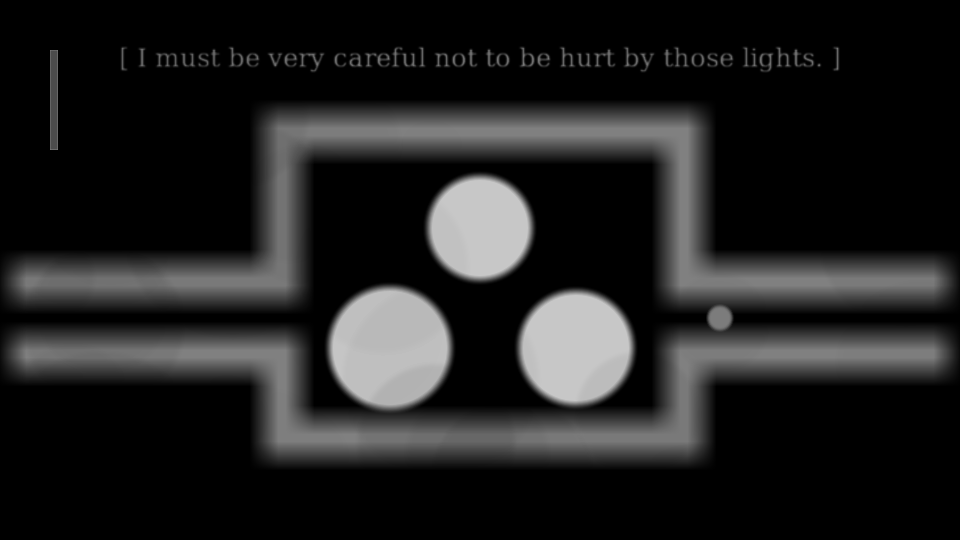
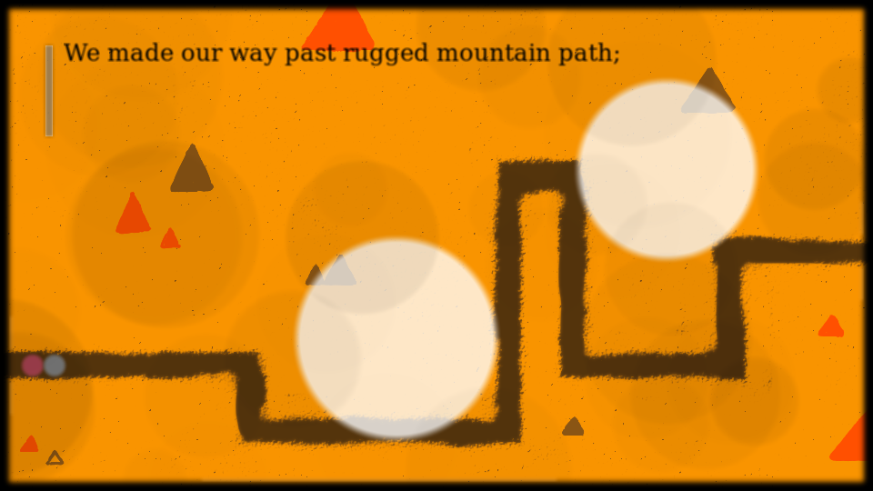
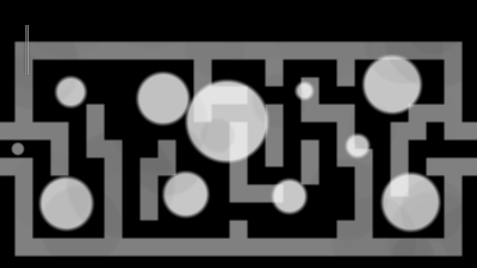

# A Lighted Story #

> Dull, gloomy, all the same in those lightless corners. My life had been like that, until......I met her.

This is an action game and interactive fiction. It is forked from [Tomorrow](https://github.com/LastLeaf/Tomorrow/), participating in **GitHub's 2015 Game Off** contest.

Tomorrow is an open source game published on Kongregate in Sep 2013.
It was created by one of our team member (LastLeaf).
Currently, it got 3.1 stars on Kongregate.
We replotted this game to make it better.

# Creative Team #

* Scripts: Chossy(English), LastLeaf(中文)
* Illustration: tongtonggggg
* Music: LastLeaf
* Programming: jetzhliu, LastLeaf

# Screenshots #

# What is Changed #

* Story. The whole story and all levels are redesigned. We change it to a love story.
* Visual Effects. We add many special effects to the game.
* Music. Two new sound tracks are added.
* Illustrations. Several background image are added, while the origin game does not have any.

# Technology Details #

* HTML5. It is an HTML5 game using canvas.
* [Createjs](https://github.com/CreateJS). Createjs is a  suite of open source libraries and tools for building rich interactive content on open web technologies. We use [EaselJS](https://github.com/CreateJS/EaselJS) library to handle our drawing on the canvas.

# How to Fork this Game #

You are free to modify this game, and republish this game under the same license.

This game is a bit more complicated than the original game _Tomorrow_. You might like to fork from [the original game](https://github.com/LastLeaf/Tomorrow).

## Tools ##

For coding, just use any editor you like. You would like [CreateJS Docs](http://www.createjs.com/#Docs) while coding.

For images, SVG images can be edited with Inkscape. However, the code accepts common jpg and png files, so you can just draw with anything.

For sound tracks, the source files are ".rg" files produced by [Rosegarden](http://www.rosegardenmusic.com/).
The flac files are generated using fluidsynth with a GeneralUser GS 1.44 soundfont.

## Code Structure ##

* `map_editor` a map editor. You can copy a line in `src/data/maps.data` into the map editor, and it can be parsed, edited, and re-encoded.
* `ost` the original sound track (.flac) with source files (.rg).
* `src` the game code.
	* `src/data` these data can be loaded.
		* `src/data/audio` ogg and mp3 sound tracks.
		* `src/data/css` css files.
		* `src/data/image` image files. Use png format in most of the cases. The source svg files are also here (but they are never loaded into the game).
		* `src/data/js` the js files.
			* `src/data/js/langs.js` basic language-related strings and font settings. Currently, this game supports English and Simplified Chinese.
			* `src/data/js/levels.js` the main game code. All logic inside game is here.
			* `src/data/js/main.js` the game initialization code. The game cover is handled here. 
			* `src/data/js/utils.js` some utilities functions.
		* `src/data/ctrl.json` special effect notation for each level.
		* `src/data/maps.data` map data. Each line corresponds to a map of a level.
		* `src/data/words_en.json` story scripts in English.
		* `src/data/words_zh-CN.json` story scripts in Simplified Chinese.
	* `src/index.html` the main html file to run the game.
* `win32` a tool to generate an offline version of the game with Mozilla XULRunner. It is not used in this game. The build guide is in [Tomorrow repo](https://github.com/LastLeaf/Tomorrow).

## Coding Suggestions ##

The game code works like an interpreter. You can edit files under `src/data` to change many things without touching the js code.

However, code modification is required if you want to change more.
While coding, you should keep it works like an interpreter. If you want to add some special effects to a level, considering add an entry in `src/data/ctrl.json`, and implement it in `src/data/js/levels.js`.

Currently, game resource list (in `src/data/main.js`) and pause menu items (in `src/data/js/levels.js`) are hard coded in js code.
Just edit the code if you need while game modification.

# The Original Game: Tomorrow #

Tomorrow is an HTML5 game by [LastLeaf](http://lastleaf.me/).

The [KONGREGATE version](http://www.kongregate.com/games/lastleaf/tomorrow) of this game has already been published.

# LICENSE #

The content of this game is under [Creative Commons Attribution-ShareAlike 4.0 International](http://creativecommons.org/licenses/by-sa/4.0/). The software of this game is under [MIT LICENSE](http://www.opensource.org/licenses/mit-license.html).
